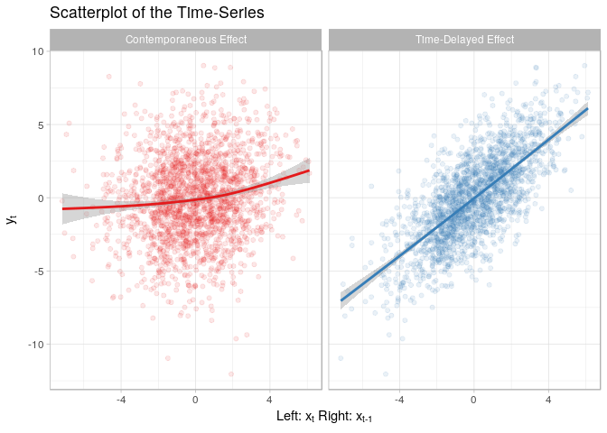

<!-- README.md is generated from README.Rmd. Please edit that file -->
RTransferEntropy
================

The goal of `RTransferEntropy` is to implement the calculation of the transfer entropy metric using Shannon's or the Renyi's methodology.

Installation
------------

You can install `RTransferEntropy` with

``` r
install.packages("RTransferEntropy")
```

or the development version from github with

``` r
# install.packages("devtools")
devtools::install_github("BZPaper/Transfer-Entropy")
```

Example using simulated data
----------------------------

Simulate a simple model to obtain two time series that are not independent (see simulation study in Dimpfl and Peter (2013)), i.e. one time series is lag of the other plus noise. In this case, one expects significant information flow from x to y and none from y to x.

### Simulating a Time-Series

``` r
library(RTransferEntropy)
library(future)
# enable parallel processing
plan(multiprocess)

set.seed(20180108)
n <- 2000
x <- rep(0, n + 1)
y <- rep(0, n + 1)

for (i in seq(n)) {
  x[i + 1] <- 0.2 * x[i] + rnorm(1, 0, 2)
  y[i + 1] <- x[i] + rnorm(1, 0, 2)
}

x <- x[-1]
y <- y[-1]
```

### Visualisation

``` r
library(ggplot2)
theme_set(theme_light())

dt <- do.call(rbind, list(
  data.frame(x = x, y = y, dir = "Level-Level", stringsAsFactors = FALSE),
  data.frame(x = x, y = c(NA, y[1:(length(y) - 1)]), dir = "Lag Y\nY->X", stringsAsFactors = FALSE),
  data.frame(x = c(NA, x[1:(length(x) - 1)]), y = y, dir = "Lag X\nX->Y", stringsAsFactors = FALSE)
))
dt$dir <- factor(dt$dir, levels = c("Lag X\nX->Y", "Level-Level", "Lag Y\nY->X"))


ggplot(dt, aes(x = x, y = y)) + 
  geom_smooth() +
  geom_point(alpha = 0.5, size = 0.5) +
  facet_grid(~dir) +
  theme_light() +
  labs(title = "X-Y Relations for Different Lags") +
  coord_fixed(ratio = 1)
```



### Shannon Transfer Entropy

``` r
set.seed(20180108 + 1)

shannon_te <- transfer_entropy(x = x, y = y)
#> Shannon's entropy on 8 cores with 100 shuffles. The timeseries have length 2000 (0 NAs removed)
#>   [calculate] X->Y transfer entropy
#>   [calculate] Y->X transfer entropy
#>   [bootstrap] 300 times
#> Done - Total time 3.84 seconds

shannon_te
#> Shannon Transfer Entropy Results:
#> -----------------------------------------------------------------
#>  Direction          TE     Eff. TE    Std.Err.     p-value    sig
#> -----------------------------------------------------------------
#>       X->Y      0.1245      0.1213      0.0015      0.0000    ***
#>       Y->X      0.0020     -0.0015      0.0016      0.8433       
#> -----------------------------------------------------------------
#> Bootstrapped TE Quantiles (300 replications):
#> -----------------------------------------------------------------
#> Direction        0%       25%       50%       75%      100%
#> -----------------------------------------------------------------
#>     X->Y    0.0008    0.0023    0.0031    0.0043    0.0107
#>     Y->X    0.0005    0.0021    0.0029    0.0039    0.0095
#> -----------------------------------------------------------------
#> Number of Observations: 2000
#> -----------------------------------------------------------------
#> p-values: < 0.001 '***', < 0.01 '**', < 0.05 '*', < 0.1 '.'
```

Alternatively, you can calculate only the transfer entropy or the effective transfer entropy with

``` r
calc_te(x, y)
#> [1] 0.1244709
calc_te(y, x)
#> [1] 0.002038284

calc_ete(x, y)
#> [1] 0.1211241
calc_ete(y, x)
#> [1] -0.001310745
```

### Renyi Transfer Entropy

``` r
set.seed(20180108 + 1)

renyi_te <- transfer_entropy(x = x, y = y, entropy = "renyi", q = 0.5)
#> Renyi's entropy on 8 cores with 100 shuffles. The timeseries have length 2000 (0 NAs removed)
#>   [calculate] X->Y transfer entropy
#>   [calculate] Y->X transfer entropy
#>   [bootstrap] 300 times
#> Done - Total time 3.2 seconds

renyi_te
#> Renyi Transfer Entropy Results:
#> -----------------------------------------------------------------
#>  Direction          TE     Eff. TE    Std.Err.     p-value    sig
#> -----------------------------------------------------------------
#>       X->Y      0.0852      0.0421      0.0213      0.0233      *
#>       Y->X      0.0276     -0.0135      0.0225      0.7000       
#> -----------------------------------------------------------------
#> Bootstrapped TE Quantiles (300 replications):
#> -----------------------------------------------------------------
#> Direction        0%       25%       50%       75%      100%
#> -----------------------------------------------------------------
#>     X->Y   -0.0188    0.0248    0.0408    0.0538    0.1164
#>     Y->X   -0.0111    0.0288    0.0414    0.0558    0.1436
#> -----------------------------------------------------------------
#> Number of Observations: 2000
#> Q: 0.5
#> -----------------------------------------------------------------
#> p-values: < 0.001 '***', < 0.01 '**', < 0.05 '*', < 0.1 '.'

calc_te(x, y, entropy = "renyi", q = 0.5)
#> [1] 0.08515726
calc_te(y, x, entropy = "renyi", q = 0.5)
#> [1] 0.02758021

calc_ete(x, y, entropy = "renyi", q = 0.5)
#> [1] 0.04324357
calc_ete(y, x, entropy = "renyi", q = 0.5)
#> [1] -0.01225754
```

Function Verbosity aka `quiet = TRUE`
=====================================

To disable the verbosity of a function you can use the argument `quiet`. Note that we have set `nboot = 0` as we don't need bootstrapped quantiles for this example.

``` r
te_s <- transfer_entropy(x, y, nboot = 0, quiet = T)

te_s
#> Shannon Transfer Entropy Results:
#> -----------------------------------------------------------------
#>  Direction          TE     Eff. TE    Std.Err.     p-value    sig
#> -----------------------------------------------------------------
#>       X->Y      0.1245      0.1212          NA          NA       
#>       Y->X      0.0020     -0.0016          NA          NA       
#> -----------------------------------------------------------------
#> For calculation of standard errors and p-values set nboot > 0
#> -----------------------------------------------------------------
#> Number of Observations: 2000
#> -----------------------------------------------------------------
#> p-values: < 0.001 '***', < 0.01 '**', < 0.05 '*', < 0.1 '.'
```

If you want to disable feedback from `transfer_entropy` functions, you can do so by using `set_quiet(TRUE)`

``` r
set_quiet(TRUE)
te_s <- transfer_entropy(x, y, nboot = 0)
te_r <- transfer_entropy(x, y, entropy = "renyi", nboot = 0)

te_s
#> Shannon Transfer Entropy Results:
#> -----------------------------------------------------------------
#>  Direction          TE     Eff. TE    Std.Err.     p-value    sig
#> -----------------------------------------------------------------
#>       X->Y      0.1245      0.1213          NA          NA       
#>       Y->X      0.0020     -0.0014          NA          NA       
#> -----------------------------------------------------------------
#> For calculation of standard errors and p-values set nboot > 0
#> -----------------------------------------------------------------
#> Number of Observations: 2000
#> -----------------------------------------------------------------
#> p-values: < 0.001 '***', < 0.01 '**', < 0.05 '*', < 0.1 '.'
te_r
#> Renyi Transfer Entropy Results:
#> -----------------------------------------------------------------
#>  Direction          TE     Eff. TE    Std.Err.     p-value    sig
#> -----------------------------------------------------------------
#>       X->Y      0.1861     -0.0336          NA          NA       
#>       Y->X      0.1215     -0.0795          NA          NA       
#> -----------------------------------------------------------------
#> For calculation of standard errors and p-values set nboot > 0
#> -----------------------------------------------------------------
#> Number of Observations: 2000
#> Q: 0.1
#> -----------------------------------------------------------------
#> p-values: < 0.001 '***', < 0.01 '**', < 0.05 '*', < 0.1 '.'

# revert back with
set_quiet(FALSE)
te_s <- transfer_entropy(x, y, nboot = 0)
#> Shannon's entropy on 8 cores with 100 shuffles. The timeseries have length 2000 (0 NAs removed)
#>   [calculate] X->Y transfer entropy
#>   [calculate] Y->X transfer entropy
#> Done - Total time 0.41 seconds
```

Parallel Programming
====================

Using the `future` package and its `plan`s we can execute all computations in parallel like so

``` r
library(future)
plan(multiprocess)
te_s <- transfer_entropy(x, y, nboot = 100)
#> Shannon's entropy on 8 cores with 100 shuffles. The timeseries have length 2000 (0 NAs removed)
#>   [calculate] X->Y transfer entropy
#>   [calculate] Y->X transfer entropy
#>   [bootstrap] 100 times
#> Done - Total time 1.52 seconds
te_r <- transfer_entropy(x, y, entropy = "renyi", nboot = 100)
#> Renyi's entropy on 8 cores with 100 shuffles. The timeseries have length 2000 (0 NAs removed)
#>   [calculate] X->Y transfer entropy
#>   [calculate] Y->X transfer entropy
#>   [bootstrap] 100 times
#> Done - Total time 1.59 seconds

# revert to sequential mode
plan(sequential)
te_s <- transfer_entropy(x, y, nboot = 100)
#> Shannon's entropy on 1 core with 100 shuffles. The timeseries have length 2000 (0 NAs removed)
#>   [calculate] X->Y transfer entropy
#>   [calculate] Y->X transfer entropy
#>   [bootstrap] 100 times
#> Done - Total time 3.9 seconds
```
