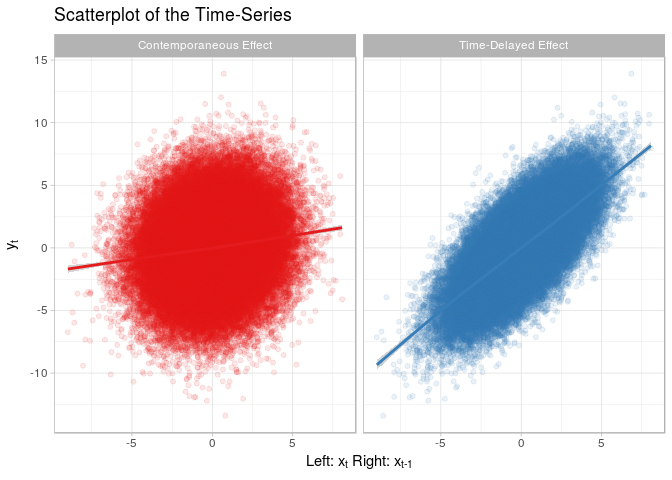

<!-- README.md is generated from README.Rmd. Please edit that file -->
RTransferEntropy
================

The goal of RTransferEntropy is to implement transfer entropy for the Shannon and the Renyi-methodology.

Installation
------------

You can install RTransferEntropy from github with:

``` r
# install.packages("devtools")
devtools::install_github("BZPaper/Transfer-Entropy")
```

Example using simulated data
----------------------------

Simulate a simple model to obtain two time series that are not independent (see simulation study in Dimpfl and Peter (2013)), i.e. one time series is lag of the other plus noise. In this case, one expects significant information flow from x to y and none from y to x.

### Simulating a Time-Series

``` r
library(RTransferEntropy)
set.seed(20180108)
n <- 100000
x <- rep(0, n + 1)
y <- rep(0, n + 1)

for (i in seq(n)) {
  x[i + 1] <- 0.2 * x[i] + rnorm(1, 0, 2)
  y[i + 1] <- x[i] + rnorm(1, 0, 2)
}

x <- x[-1]
y <- y[-1]
```

### Visualisation

``` r
library(data.table)
library(ggplot2)
library(latex2exp)
theme_set(theme_light())

df <- rbindlist(list(
  data.table(x, y, grp = "Contemporaneous Effect"),
  data.table(shift(x, 1), y, grp = "Time-Delayed Effect")
))

ggplot(df, aes(x = x, y = y, color = grp)) + 
  geom_point(alpha = 0.1) +
  geom_smooth() +
  facet_wrap(~grp) +
  labs(x = TeX("Left: x_t Right: x_{t-1}"), y = TeX("y_t"), 
       title = "Scatterplot of the Time-Series") +
  scale_color_brewer(palette = "Set1", guide = F)
#> `geom_smooth()` using method = 'gam'
#> Warning: Removed 1 rows containing non-finite values (stat_smooth).
#> Warning: Removed 1 rows containing missing values (geom_point).
```



### Shannon Transfer Entropy

``` r
set.seed(20180108 + 1)
n_cores <- parallel::detectCores() - 1

shannon_te <- transfer_entropy(x = x,
                               lx = 1,
                               y = y,
                               ly = 1,
                               nboot = n_cores,
                               cl = n_cores)
#> Calculating Shannon's entropy on 7 cores with 6 shuffle(s) and 7 bootstrap(s)
#> The timeseries have length 100000 (0 NAs removed)
#> Calculate the x->y transfer entropy
#> Calculate the y->x transfer entropy
#> Bootstrap the transfer entropy
#> Done - Total time 74.4 seconds

shannon_te
#> Transfer Entropy Result:
#> Direction          te         ete        sete     p-value   sign
#> ----------------------------------------------------------------
#> X->Y          0.09686     0.09679          NA          NA       
#> Y->X          0.00011     0.00004          NA          NA       
#> ----------------------------------------------------------------
#> Number of Observations: 100000
#> ----------------------------------------------------------------
```
