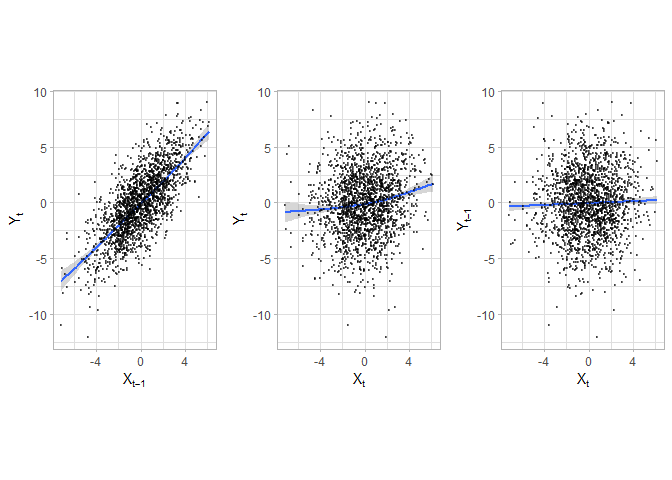

<!-- README.md is generated from README.Rmd. Please edit that file -->

[](https://travis-ci.org/BZPaper/RTransferEntropy)
[](https://cran.r-project.org/package=RTransferEntropy)
[](https://cran.r-project.org/package=RTransferEntropy)

# RTransferEntropy

The goal of `RTransferEntropy` is to implement the calculation of the
transfer entropy metric using Shannon’s or the Renyi’s methodology.

## Installation

You can install `RTransferEntropy` with

``` r
install.packages("RTransferEntropy")
```

or the development version from github with

``` r
# install.packages("devtools")
devtools::install_github("BZPaper/RTransferEntropy")
```

## Example using simulated data

Simulate a simple model to obtain two time series that are not
independent (see simulation study in Dimpfl and Peter (2013)), i.e. one
time series is lag of the other plus noise. In this case, one expects
significant information flow from x to y and none from y to x.

### Simulating a Time-Series

``` r
library(RTransferEntropy)
library(future)
# enable parallel processing
plan(multiprocess)

set.seed(20180108)
n <- 2000
x <- rep(0, n + 1)
y <- rep(0, n + 1)

for (i in seq(n)) {
  x[i + 1] <- 0.2 * x[i] + rnorm(1, 0, 2)
  y[i + 1] <- x[i] + rnorm(1, 0, 2)
}

x <- x[-1]
y <- y[-1]
```

### Visualisation

``` r
library(ggplot2)
library(gridExtra)
theme_set(theme_light())

# Lagged X-Plot
p1 <- ggplot(data.frame(x = c(NA, x[1:(length(x) - 1)]), y = y), aes(x, y)) +
  geom_smooth() +
  geom_point(alpha = 0.5, size = 0.5) +
  labs(x = expression(X[t - 1]), y = expression(Y[t])) +
  coord_fixed(1) +
  scale_x_continuous(limits = range(x)) +
  scale_y_continuous(limits = range(y))

# X-Y Plot
p2 <- ggplot(data.frame(x = x, y = y), aes(x, y)) +
  geom_smooth() +
  geom_point(alpha = 0.5, size = 0.5) +
  labs(x = expression(X[t]), y = expression(Y[t])) +
  coord_fixed(1) +
  scale_x_continuous(limits = range(x)) +
  scale_y_continuous(limits = range(y))

# Lagged Y Plot
p3 <- ggplot(data.frame(x = x, y = c(NA, y[1:(length(y) - 1)])), aes(x, y)) +
  geom_smooth() +
  geom_point(alpha = 0.5, size = 0.5) +
  labs(x = expression(X[t]), y = expression(Y[t - 1])) +
  coord_fixed(1) +
  scale_x_continuous(limits = range(x)) +
  scale_y_continuous(limits = range(y))

a <- grid.arrange(p1, p2, p3, ncol = 3)
```

<!-- -->

### Shannon Transfer Entropy

``` r
set.seed(20180108 + 1)

shannon_te <- transfer_entropy(x = x, y = y)
#> Shannon's entropy on 8 cores with 100 shuffles.
#>   x and y have length 2000 (0 NAs removed)
#>   [calculate] X->Y transfer entropy
#>   [calculate] Y->X transfer entropy
#>   [bootstrap] 300 times
#> Done - Total time 3.14 seconds

shannon_te
#> Shannon Transfer Entropy Results:
#> -----------------------------------------------------------
#> Direction        TE   Eff. TE  Std.Err.   p-value    sig
#> -----------------------------------------------------------
#>      X->Y    0.1245    0.1213    0.0015    0.0000    ***
#>      Y->X    0.0020    0.0000    0.0016    0.8433       
#> -----------------------------------------------------------
#> Bootstrapped TE Quantiles (300 replications):
#> -----------------------------------------------------------
#> Direction      0%     25%     50%     75%    100%
#> -----------------------------------------------------------
#>      X->Y  0.0008  0.0023  0.0031  0.0043  0.0107
#>      Y->X  0.0005  0.0021  0.0029  0.0039  0.0095
#> -----------------------------------------------------------
#> Number of Observations: 2000
#> -----------------------------------------------------------
#> p-values: < 0.001 '***', < 0.01 '**', < 0.05 '*', < 0.1 '.'

summary(shannon_te)
#> Shannon's Transfer Entropy
#> 
#> Coefficients:
#>             te       ete     se p-value    
#> X->Y 0.1244709 0.1212710 0.0015  <2e-16 ***
#> Y->X 0.0020383 0.0000000 0.0016  0.8433    
#> ---
#> Signif. codes:  0 '***' 0.001 '**' 0.01 '*' 0.05 '.' 0.1 ' ' 1
#> 
#> Bootstrapped TE Quantiles (300 replications):
#> Direction      0%     25%     50%     75%    100%
#>      X->Y  0.0008  0.0023  0.0031  0.0043  0.0107
#>      Y->X  0.0005  0.0021  0.0029  0.0039  0.0095 
#> 
#> Number of Observations: 2000
```

Alternatively, you can calculate only the transfer entropy or the
effective transfer entropy with

``` r
calc_te(x, y)
#> [1] 0.1244709
calc_te(y, x)
#> [1] 0.002038284

calc_ete(x, y)
#> [1] 0.1211241
calc_ete(y, x)
#> [1] 0
```

### Renyi Transfer Entropy

``` r
set.seed(20180108 + 1)

renyi_te <- transfer_entropy(x = x, y = y, entropy = "renyi", q = 0.5)
#> Renyi's entropy on 8 cores with 100 shuffles.
#>   x and y have length 2000 (0 NAs removed)
#>   [calculate] X->Y transfer entropy
#>   [calculate] Y->X transfer entropy
#>   [bootstrap] 300 times
#> Done - Total time 2.79 seconds

renyi_te
#> Renyi Transfer Entropy Results:
#> -----------------------------------------------------------
#> Direction        TE   Eff. TE  Std.Err.   p-value    sig
#> -----------------------------------------------------------
#>      X->Y    0.0852    0.0421    0.0213    0.0233      *
#>      Y->X    0.0276   -0.0135    0.0225    0.7000       
#> -----------------------------------------------------------
#> Bootstrapped TE Quantiles (300 replications):
#> -----------------------------------------------------------
#> Direction      0%     25%     50%     75%    100%
#> -----------------------------------------------------------
#>      X->Y  -0.0188  0.0248  0.0408  0.0538  0.1164
#>      Y->X  -0.0111  0.0288  0.0414  0.0558  0.1436
#> -----------------------------------------------------------
#> Number of Observations: 2000
#> Q: 0.5
#> -----------------------------------------------------------
#> p-values: < 0.001 '***', < 0.01 '**', < 0.05 '*', < 0.1 '.'

calc_te(x, y, entropy = "renyi", q = 0.5)
#> [1] 0.08515726
calc_te(y, x, entropy = "renyi", q = 0.5)
#> [1] 0.02758021

calc_ete(x, y, entropy = "renyi", q = 0.5)
#> [1] 0.04324357
calc_ete(y, x, entropy = "renyi", q = 0.5)
#> [1] -0.01225754
```

# Function Verbosity aka `quiet = TRUE`

To disable the verbosity of a function you can use the argument `quiet`.
Note that we have set `nboot = 0` as we don’t need bootstrapped
quantiles for this example.

``` r
te <- transfer_entropy(x, y, nboot = 0, quiet = T)

te
#> Shannon Transfer Entropy Results:
#> -----------------------------------------------------------
#> Direction        TE   Eff. TE  Std.Err.   p-value    sig
#> -----------------------------------------------------------
#>      X->Y    0.1245    0.1212        NA        NA       
#>      Y->X    0.0020    0.0000        NA        NA       
#> -----------------------------------------------------------
#> For calculation of standard errors and p-values set nboot > 0
#> -----------------------------------------------------------
#> Number of Observations: 2000
#> -----------------------------------------------------------
#> p-values: < 0.001 '***', < 0.01 '**', < 0.05 '*', < 0.1 '.'
```

If you want to disable feedback from `transfer_entropy` functions, you
can do so by using `set_quiet(TRUE)`

``` r
set_quiet(TRUE)
te <- transfer_entropy(x, y, nboot = 0)

te
#> Shannon Transfer Entropy Results:
#> -----------------------------------------------------------
#> Direction        TE   Eff. TE  Std.Err.   p-value    sig
#> -----------------------------------------------------------
#>      X->Y    0.1245    0.1213        NA        NA       
#>      Y->X    0.0020    0.0000        NA        NA       
#> -----------------------------------------------------------
#> For calculation of standard errors and p-values set nboot > 0
#> -----------------------------------------------------------
#> Number of Observations: 2000
#> -----------------------------------------------------------
#> p-values: < 0.001 '***', < 0.01 '**', < 0.05 '*', < 0.1 '.'

# revert back with
set_quiet(FALSE)

te <- transfer_entropy(x, y, nboot = 0)
#> Shannon's entropy on 8 cores with 100 shuffles.
#>   x and y have length 2000 (0 NAs removed)
#>   [calculate] X->Y transfer entropy
#>   [calculate] Y->X transfer entropy
#> Done - Total time 0.09 seconds
```

# Parallel Programming

Using the `future` package and its `plan`s we can execute all
computations in parallel like so

``` r
library(future)
plan(multiprocess)
te <- transfer_entropy(x, y, nboot = 100)
#> Shannon's entropy on 8 cores with 100 shuffles.
#>   x and y have length 2000 (0 NAs removed)
#>   [calculate] X->Y transfer entropy
#>   [calculate] Y->X transfer entropy
#>   [bootstrap] 100 times
#> Done - Total time 1.14 seconds

# revert to sequential mode
plan(sequential)
te <- transfer_entropy(x, y, nboot = 100)
#> Shannon's entropy on 1 core with 100 shuffles.
#>   x and y have length 2000 (0 NAs removed)
#>   [calculate] X->Y transfer entropy
#>   [calculate] Y->X transfer entropy
#>   [bootstrap] 100 times
#> Done - Total time 3.99 seconds
```
